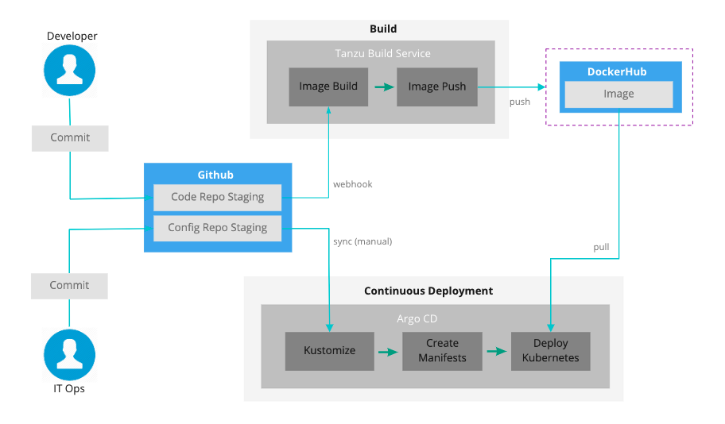

#  Deployment to Kubernetes using Tanzu Build Service, Kustomize and ArgoCD

This repository showcases a use case deployment of a sample Spring boot application right from Git source to local Kubernetes cluster (Docker Desktop) using the following:

**Tanzu Build Service** - used to automatically trigger a build on code commit which in turn uses CNB (Cloud Native Buildpacks) to create a docker image from the source code and push it to DockerHub. 

**Kustomize** - used to create separate deployment configuration for development and production environments. Refer [here](https://docs.pivotal.io/build-service/1-0/installing.html) for installation instructions.

**Argocd** - Declarative gitops tool that keeps the kubernetes deployment in sync with the ops repository which contains the Kubernetes manifest files. Refer [here](https://argoproj.github.io/argo-cd/cli_installation/) for installation instructions

The following diagram illustrates the solution implemented using the above tools:



# Deploy Locally

Modify the `dockerhub-credentails.yaml` to include a base64 encoded string of Docker `config.json` file. Add valid Github credentials to `github-credentials.yaml`. Modify `image.yaml` to include the Github repository URL and Docker Image registry. 

To deploy locally, run the following for creating the TBS resource definition:

```kubectl create -f project.yaml -f dockerhub-credentails.yaml -f github-credentials.yaml -f service-account.yaml -f image.yaml```

Create an application in ArgoCD and configure the path to one of the overlays folder. 
